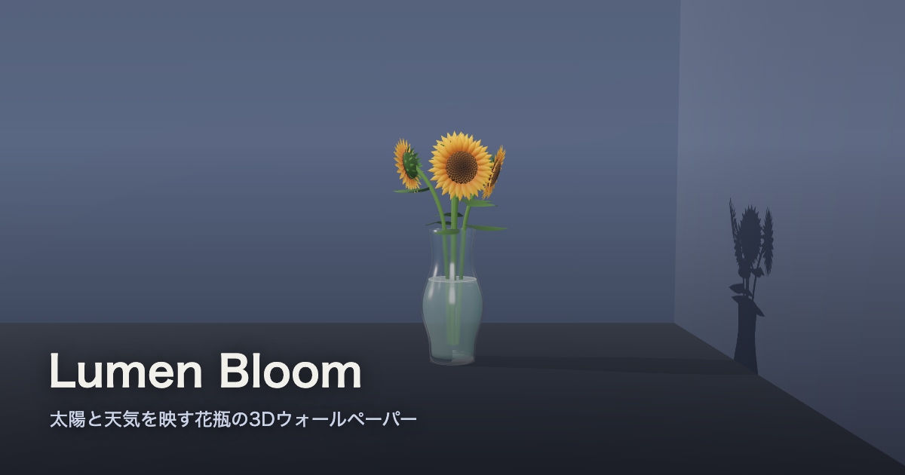

# Lumen Bloom — 太陽と天気を映す花瓶

**[▶ 開く](https://lumen-bloom.vercel.app)**

現在地の緯度経度から計算したリアルタイムの太陽・月の位置で部屋の隅に置かれた花瓶に窓越しの光と影を落とし、現在地の天気(晴れ/曇り/霧/雨/雪/雷雨)を空間の雰囲気に反映する、常時起動できる3Dウォールペーパー。



## 特徴

- **プロシージャル生成のひまわり+ガラス花瓶** — 外部3Dアセット不使用。壁厚のある中空ガラス花瓶(水入り・水面のメニスカス付き)に、フィロタキシス(黄金角)螺旋の種盤・二重の舌状花・萼・葉まで数式生成。`?obj=vase-tulips` でチューリップに切替可。
- **実太陽光と窓格子** — Meeus低精度式による太陽位置計算(外部天文ライブラリ不使用)。窓型のgoboを通した光が桟の影ごと床と壁に落ち、朝夕は暖色・夜へは市民薄明を連続補間。
- **月光** — Meeus ch.47/48による月位置・月齢計算。夜は満ち欠けに応じた青い月明かりが差し、HUDに月相グリフを表示。
- **実天気** — [Open-Meteo](https://open-meteo.com/)(無料・APIキー不要)から現在地の天気を取得し、空の色・環境光・霧・雨/雪パーティクルに反映。雷雨では稲光、降雪中は床がうっすら白く、氷点下ではガラスが曇る。
- **微風** — 茎ごとに位相の異なるごくわずかな揺らぎ。
- **スムーズな遷移** — 天気・昼夜の変化は約2秒の指数イージングで滑らかに。
- **HUD** — 時刻・天気・気温(+夜は月相)を隅に表示。クリックで非表示(記憶)。
- **URLパラメータ** — `?lat=&lng=`(場所固定)、`?t=`(時刻シフト)、`?obj=`(オブジェクト)、`?hud=1/0`。
- **常時起動を想定** — タブ非表示中はループ・ポーリング停止、表示中はWake Lockで画面スリープ防止、`prefers-reduced-motion` では静止画運用。

## 起動

```bash
npm install
npm run dev      # http://localhost:5173
```

## 開発

```bash
npm run typecheck   # tsc --noEmit
npm run test        # Vitest（純ロジック）
npm run coverage    # src/engine を 100% カバレッジでゲート
npm run build       # 型チェック + 本番ビルド
```

### 構成

- `src/engine/` — 純ロジック(太陽/月の位置・月齢 `astro/`、方向ベクトル/花瓶プロファイル/フィロタキシス/花びら曲面 `geometry/`、現在地 `geolocation/`、天気クライアント `weather/`、演出用シーン状態 `scene-state/`、URLパラメータ `urlState.ts`)。Vitest で 100% カバレッジを維持。Three.js に依存しない。
- `src/scene/` — Three.js のシーン組み立て(レンダラー、部屋 `objects/room.ts`、花瓶/ひまわり/チューリップ `objects/`、太陽光+窓gobo/月光 `lighting/`、天気パーティクル `weatherFx/`)。カバレッジ対象外。
- `src/ui/` — 最小限のDOM(位置情報許可プロンプト・HUD・Wake Lock)。
- `src/orchestrator.ts` — Geolocation/URLオーバーライド→太陽・月ループ→天気ポーリング→シーン更新の結線。
- `src/main.ts` — 軽量ブートストラップ。`orchestrator.ts` を `import()` で読み込む。
- `public/` — `manifest.webmanifest`(maskable PNGアイコン)・`sw.js`(オフラインシェル)・`favicon.svg`。

## 技術スタック

- Three.js
- Vite + TypeScript(Vanilla)
- Vitest（`src/engine` 100%カバレッジ）
- Vercel Analytics
- Open-Meteo API（天気、APIキー不要）

## 品質指標（2026-07-14 計測）

- Lighthouse: **desktop 99/100/100/100・mobile 92/100/100/100**（常時3D描画のTBTは適応フレームレートで6.3s→280msに削減）
- Mozilla Observatory: **A+（score 120・tests 10/10）**
- テスト: **179**（`src/engine` 100%カバレッジゲート・CI強制）
- npm audit: **0件** / gitleaks: **0件**
