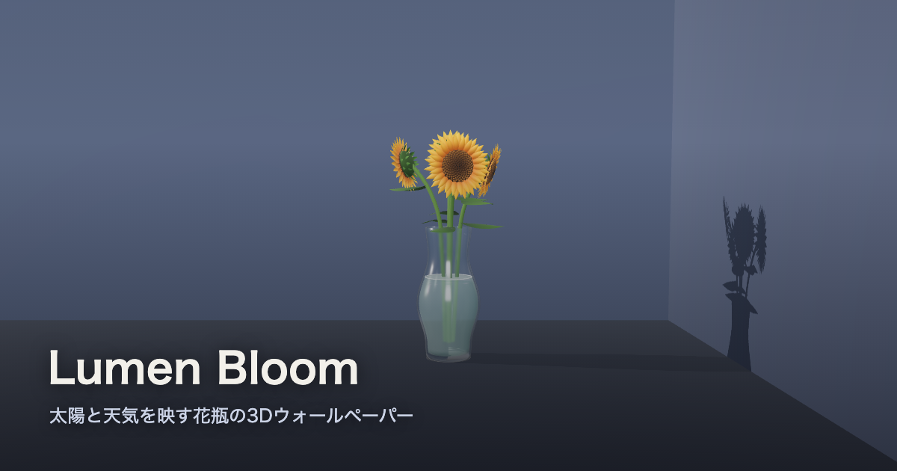

# Lumen Bloom — 太陽と天気を映す花瓶

**[▶ 開く](https://lumen-bloom.saitotakuya0719.workers.dev)**

現在地の緯度経度から計算したリアルタイムの太陽・月の位置で部屋の隅に置かれた花瓶に窓越しの光と影を落とし、現在地の天気(晴れ/曇り/霧/雨/雪/雷雨)を空間の雰囲気に反映する、常時起動できる3Dウォールペーパー。



## 特徴

- **週替わりの季節アレンジメント** — 全46種(ひまわり・チューリップ・コスモス・キバナコスモス・アネモネ・ガーベラ・マーガレット・ノコンギク・ポピー・桔梗・芍薬・牡丹・ダリア・マム・カーネーション・バラ・トルコキキョウ・ラナンキュラス・紫陽花・アナベル・水仙・ラッパ水仙・ムスカリ・ユリ・スカシユリ・ラベンダー・かすみ草・リンドウ・カラー・アヤメ・花菖蒲・彼岸花・ススキ・梅・蝋梅・桃・桜・ミモザ・椿・山茶花・金木犀・紫式部・紅葉・南天・ドウダンツツジ・ユーカリ)を月ごとに6候補ずつ、週1回自動で入れ替え(同じ花が2週続くことはない)。花に合わせて花瓶も変わる(透明/ロゼ/コバルト/スモークガラス+水入り、白磁/青磁/黒陶/テラコッタなどの陶器、真鍮の金属)。南半球では季節を6ヶ月シフト。`?obj=<id>` で任意のアレンジに固定可。
- **完全プロシージャル生成** — 外部3Dアセット不使用。花びら/萼/葉は同一のパラメトリック曲面のプロポーション違い、ひまわりの種盤はフィロタキシス(黄金角)螺旋、枝物は主枝+側枝に花・葉・実をインスタンス配置。椿は花ごと落ち、山茶花は花びらが一枚ずつ散る。
- **実太陽光と窓格子** — Meeus低精度式による太陽位置計算(外部天文ライブラリ不使用)。窓型のgoboを通した光が桟の影ごと床と壁に落ち、朝夕は暖色・夜へは市民薄明を連続補間。
- **月光** — Meeus ch.47/48による月位置・月齢計算。夜は満ち欠けに応じた青い月明かりが差し、HUDに月相グリフを表示。
- **実天気** — [Open-Meteo](https://open-meteo.com/)(無料・APIキー不要)から現在地の天気を取得し、空の色・環境光・霧・雨/雪パーティクルに反映。雷雨では稲光、降雪中は床がうっすら白く、氷点下ではガラスが曇る。
- **微風** — 茎ごとに位相の異なるごくわずかな揺らぎ。
- **スムーズな遷移** — 天気・昼夜の変化は約2秒の指数イージングで滑らかに。
- **HUD+花の解説カード** — 時刻・天気・気温・今週の花(+夜は月相)のHUDと、右下に今週の花の解説(花言葉つき)。どちらもクリック/×で非表示(記憶)。
- **URLパラメータ** — `?lat=&lng=`(場所固定)、`?t=`(時刻シフト)、`?obj=`(sunflower/tulip/cosmos/kibana-cosmos/anemone/gerbera/margaret/nokongiku/poppy/kikyou/peony/botan/dahlia/mum/carnation/rose/lisianthus/ranunculus/hydrangea/annabelle/suisen/rappa-suisen/muscari/lily/sukashiyuri/lavender/kasumisou/rindou/calla/ayame/hanashoubu/higanbana/susuki/ume/roubai/momo/sakura/mimosa/tsubaki/sazanka/kinmokusei/murasakishikibu/momiji/nanten/doudan/eucalyptus)、`?hud=1/0`、`?info=1/0`(解説カード)。
- **常時起動を想定** — タブ非表示中はループ・ポーリング停止、表示中はWake Lockで画面スリープ防止、`prefers-reduced-motion` では静止画運用。

## 起動

```bash
npm install
npm run dev      # http://localhost:5173
```

## 開発

```bash
npm run typecheck   # tsc --noEmit
npm run test        # Vitest（純ロジック）
npm run coverage    # src/engine を 100% カバレッジでゲート
npm run build       # 型チェック + 本番ビルド
```

### 構成

- `src/engine/` — 純ロジック(太陽/月の位置・月齢 `astro/`、方向ベクトル/花瓶プロファイル/フィロタキシス/花びら曲面 `geometry/`、季節カタログ+週選択 `arrangements.ts`、現在地 `geolocation/`、天気クライアント `weather/`、演出用シーン状態 `scene-state/`、URLパラメータ `urlState.ts`)。Vitest で 100% カバレッジを維持。Three.js に依存しない。
- `src/scene/` — Three.js のシーン組み立て(レンダラー、部屋 `objects/room.ts`、花瓶+各種フローラ `objects/flora/`、アレンジ組立 `objects/arrangementFactory.ts`、太陽光+窓gobo/月光 `lighting/`、天気パーティクル `weatherFx/`)。カバレッジ対象外。
- `src/ui/` — 最小限のDOM(位置情報許可プロンプト・HUD・Wake Lock)。
- `src/orchestrator.ts` — Geolocation/URLオーバーライド→太陽・月ループ→天気ポーリング→シーン更新の結線。
- `src/main.ts` — 軽量ブートストラップ。`orchestrator.ts` を `import()` で読み込む。
- `src/scene/stage.ts` — Three.js 側の入口(別チャンク)。文字の表示を先に済ませてから読み込み、3D の初期化は数タスクに分けて進める。
- `public/` — `manifest.webmanifest`(maskable PNGアイコン)・`sw.js`(オフラインシェル)・`favicon.svg`。

## 技術スタック

- Three.js
- Vite + TypeScript(Vanilla)
- Vitest（`src/engine` 100%カバレッジ）
- Vercel Analytics
- Open-Meteo API（天気、APIキー不要）

## 品質指標（2026-07-14 計測）

- Lighthouse: **desktop 99/100/100/100・mobile 92/100/100/100**（常時3D描画のTBTは適応フレームレートで6.3s→280msに削減）
- Mozilla Observatory: **A+（score 120・tests 10/10）**
- テスト: **179**（`src/engine` 100%カバレッジゲート・CI強制）
- npm audit: **0件** / gitleaks: **0件**

## ホスティング

本番は **Cloudflare Workers (static assets)**: https://lumen-bloom.saitotakuya0719.workers.dev

2026-08-11、Vercel 無料枠の超過でアカウントが停止（全プロジェクトが
`402 DEPLOYMENT_DISABLED`）したため移行した。ビルド成果物は純粋な静的
ファイルなので Worker スクリプトは無く、`wrangler.jsonc` の `assets` だけで
配信している。セキュリティヘッダーは `public/_headers`（`vercel.json` の
`headers` を移植したもの）。`npm run deploy` で build + wrangler deploy。
Vercel 側の設定も残置してあるので、復旧すれば両方に出せる。
